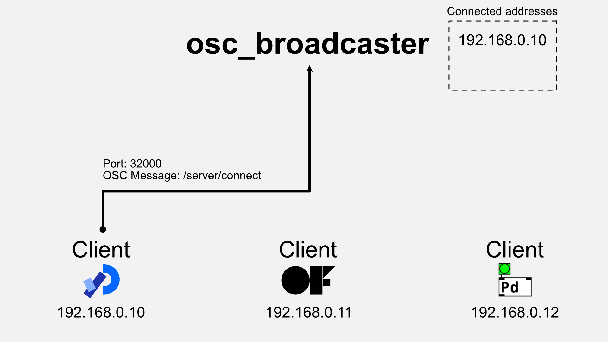
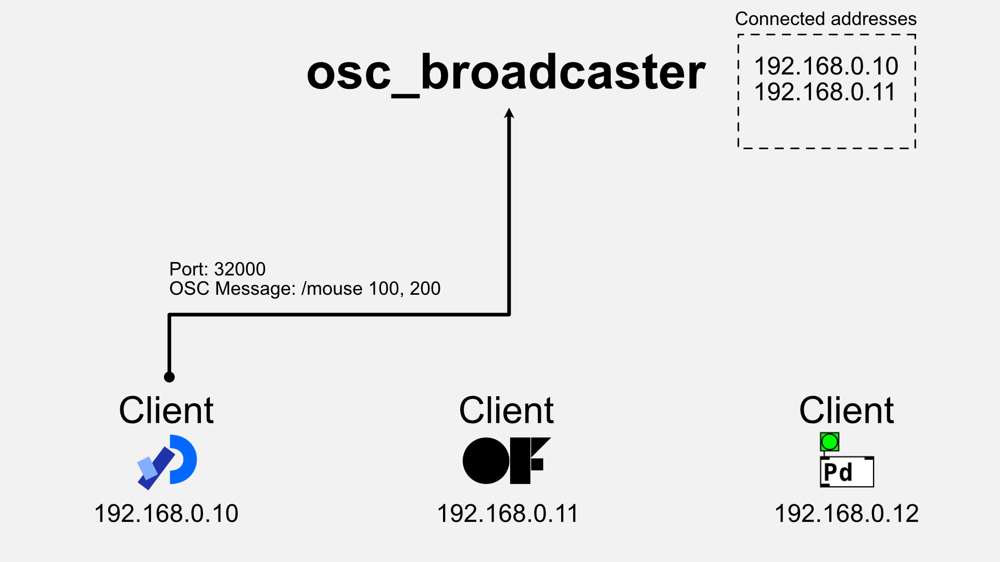

An OSC (Open Sound Control) broadcast server that can be started from the command line.
It is a Rust implementation of [oscP5broadcaster](https://sojamo.de/libraries/oscP5/examples/oscP5broadcaster/oscP5broadcaster.pde).
oscP5broadcaster is a sample application of [oscP5](https://sojamo.de/libraries/oscP5/).

1. [Installation](#installation)
2. [Usage](#usage)
3. [Client examples](#client-examples)
4. [Advanced](#advanced)
   1. Multiple client applications locally

# Installation

## Install using Homebrew

```shell
brew tap enkatsu/osc_broadcaster
brew install osc_broadcaster
```

## Download and use the binary file

[here](https://github.com/enkatsu/osc_broadcaster/releases)

## Build from source code using Cargo

```shell
git clone https://github.com/enkatsu/osc_broadcaster.git
cd osc_broadcaster
cargo install
```

# Usage

```
USAGE:
    osc_broadcaster [OPTIONS]

OPTIONS:
    -f, --file <FILE>
            Reads the initial state of connected clients from a file (JSON, YAML, TOML, CSV)

    -h, --help
            Print help information

    -i, --listen-ip-address <LISTEN_IP_ADDRESS>
            Specify the listen IP address of the broadcast server [default: 0.0.0.0]

    -l, --listen-port <LISTEN_PORT>
            Specify the listen port of the broadcast server [default: 32000]

    -s, --send-port <SEND_PORT>
            Specify the send port of the broadcast server [default: 12000]

    -V, --version
            Print version information
```

## Connect

You can register as a target client from the distribution by sending an OSC message to osc_broadcast with the address pattern `/server/connect` from your client application.

Additionally, it is possible to specify the port number to broadcast for each IP address by appending the port number to the first argument of the OSC message.
For example, a message like `/server/connect 12001`.
This feature is useful when connecting multiple client applications locally.
Details are explained on this page.




## Broadcast

When the destination clients are registered with osc_broadcast, sending an OSC message to osc_broadcast will distribute the message to all destination clients.




## Disconnect

You can exclude a target client from the distribution by sending an OSC message to "osc_broadcast" with the address pattern `/server/disconnect` from your client application.

If the port number to broadcast is specified for each IP address,
the port number must be added to the first argument of the OSC message.
For example, a message like `/server/disconnect 12001`.
Details are explained on that page.


# Client examples

Some example implementations of client applications are presented on the [client examples page](./client_examples).


# Advanced

More advanced uses of this application can be found [here](./advanced).
