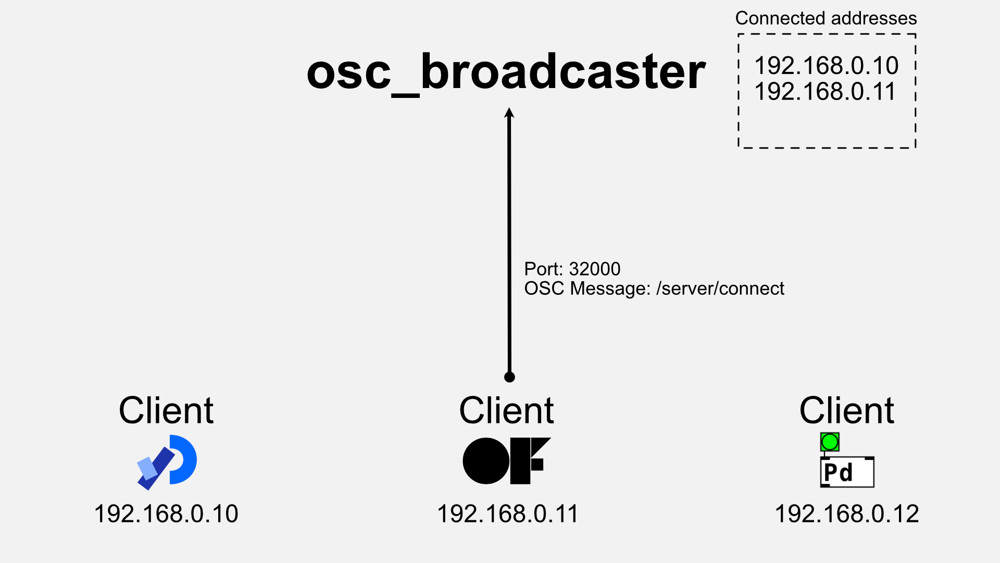
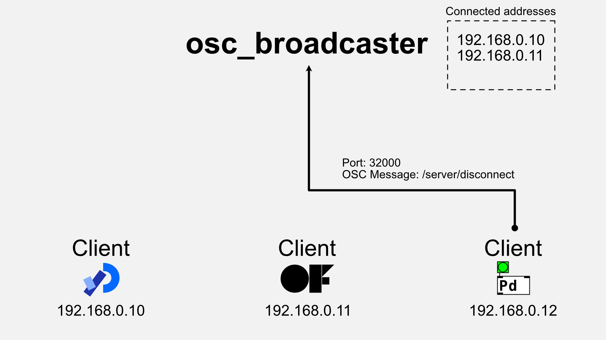

An OSC (Open Sound Control) broadcast server that can be started from the command line.
It is a Rust implementation of [oscP5broadcaster](https://sojamo.de/libraries/oscP5/examples/oscP5broadcaster/oscP5broadcaster.pde).
oscP5broadcaster is a sample application of [oscP5](https://sojamo.de/libraries/oscP5/).

## Installation

### Install with Homebrew

```shell
brew tap enkatsu/osc_broadcaster
brew install osc_broadcaster
```

### Download and use the binary file

[here](https://github.com/enkatsu/osc_broadcaster/releases)

### Build from source code

```shell
git clone https://github.com/enkatsu/osc_broadcaster.git
cd osc_broadcaster
cargo install
```

## Usage

```
USAGE:
    osc_broadcaster [OPTIONS]

OPTIONS:
    -h, --help                                     Print help information
    -i, --listen-ip-address <LISTEN_IP_ADDRESS>    [default: 0.0.0.0]
    -l, --listen-port <LISTEN_PORT>                [default: 32000]
    -s, --send-port <SEND_PORT>                    [default: 12000]
    -V, --version                                  Print version information
```

### Connect

You can register as a target client from the distribution by sending an OSC message to osc_broadcast with the address pattern "/server/connect" from your client application.




### Broadcast

When the destination clients are registered with osc_broadcast, sending an OSC message to osc_broadcast will distribute the message to all destination clients.


### Disconnect

You can exclude a target client from the distribution by sending an OSC message to "osc_broadcast" with the address pattern "/server/disconnect" from your client application.



